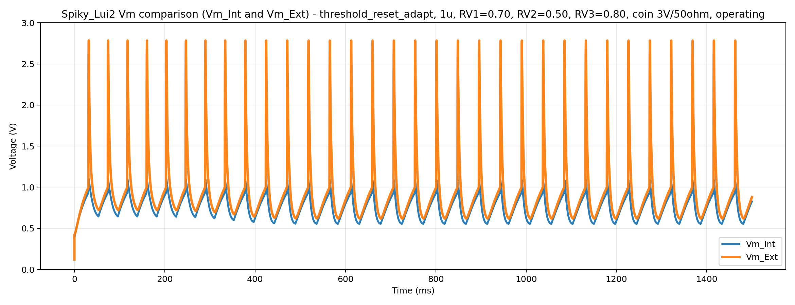
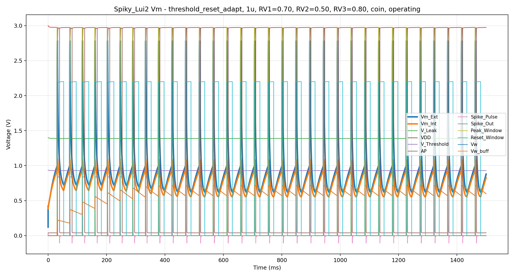
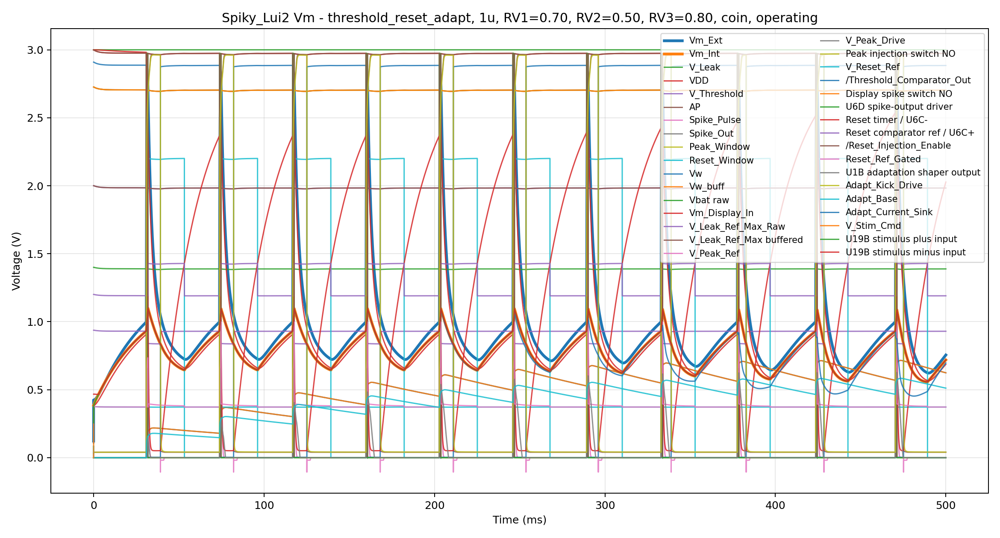
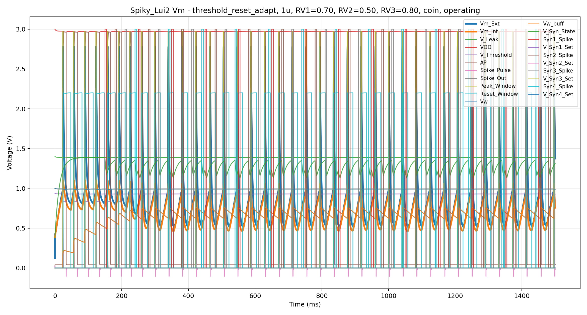
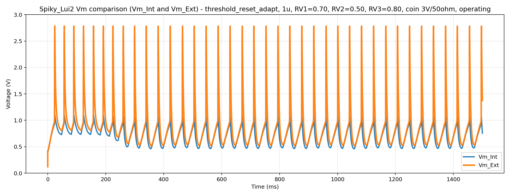
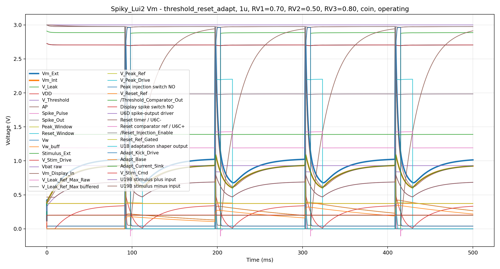
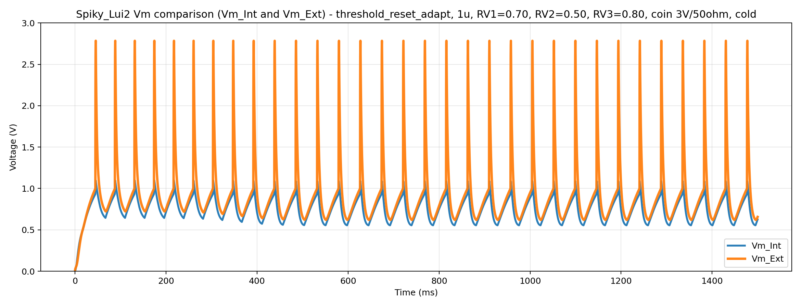

# LIFeling SPICE simulation

This folder contains the Python/ngspice simulation workflow for the Vm-relevant part of the **LIFeling** analog neuron circuit.

The main simulation file is:

```text
Spice.py
```

`Spice.py` generates a SPICE deck, runs a transient simulation, saves compact trace data, creates plots, and writes a text report with validation diagnostics.

The model is a **controlled behavioural SPICE model**. It is not a raw KiCad-exported netlist. Its purpose is to make the important LIFeling circuit blocks easy to simulate, inspect, and validate while keeping the generated SPICE deck readable.

---

## 1. What this simulation is for

The simulation is intended to answer practical circuit questions such as:

- Does the membrane voltage integrate and leak as expected?
- Does the threshold comparator trigger at the intended point?
- Does the AP / spike pulse path fire correctly?
- Does the peak/reset sequence recover, or does it latch?
- Does the external live output `Vm_Ext` show a usable neuron-like trace?
- Does the adaptation path affect firing over time?
- Do synaptic inputs perturb the membrane in the expected direction?
- Does the buffered `V_Leak_Ref_Max` reference remain stable when RV1 and RV6-RV9 are connected?
- How do RV1, RV2, RV3, RV4, RV5, RV6, RV7, RV8, and RV9 affect behaviour?

The most important user-facing trace is:

```text
Vm_Ext
```

`Vm_Ext` is the modelled physical/live analog output. `Vm_Int` is still saved because it is the internal membrane computation node, but it is not the final output that a user would normally probe.

---

## 2. Model fidelity and limitations

This model is best used for **functional validation**, debugging, and design exploration. It is not intended to replace final analogue verification against the PCB, oscilloscope captures, and component-level measurements.

Important simplifications:

| Area | How it is represented |
|---|---|
| Op-amps | Default mode uses robust behavioural/follower approximations. Vendor models are optional. |
| Comparators | Default mode uses an open-drain behavioural comparator approximation. |
| TS5A3166 switches | Represented by idealised switch models with finite on-resistance. |
| Coin-cell supply | Optional simplified `VBAT_RAW -> RBAT -> VDD` model with local decoupling. |
| RV4 capacitor selection | Represented as an idealised membrane-capacitor selector. |
| RGB LEDs and visual indicators | Omitted to keep the Vm model focused. |
| Boost converter / full power front end | Not modelled in detail. |
| PCB parasitics | Not modelled except for selected explicit capacitors/resistors. |

The default fallback models are intentionally stable and readable. Use `--strict-vendor` only when the required vendor model files are present and their pin order has been checked.

---

## 3. Circuit blocks currently modelled

| Circuit block | Modelled purpose |
|---|---|
| Supply rail | Ideal `VDD` or simplified coin-cell model `VBAT_RAW -> RBAT -> VDD`, with local decoupling. |
| `V_Leak_Ref_Max` reference | R4/R5 raw divider followed by U2A buffer. The buffered node feeds downstream reference uses. |
| RV1 / leak reference | Sets `/V_Leak_ref`, then U1A buffers it to `V_Leak`. |
| Passive membrane | RV2 leak path, selected membrane capacitor, `Vm_Int`, and clamp approximations. |
| External stimulus path | `Stimulus_Ext` through the U19B closed-loop equivalent into `Vm_Int`. |
| Threshold detection | U6B comparator, AP generation, `/Rising_AP`, `Spike_Pulse`, and negative clamp. |
| Peak injection | R8/R9 peak reference, U2C buffer, R49/U14 peak switch into `Vm_Int`. |
| Reset window | U6A/U6C timing, peak/reset windows, reset-current injection chain. |
| Spike output | U6D/R81/R82/D18 approximation for `Spike_Out`. |
| Adaptation | U1B/U1C/U1D, `/Vkick`, `Vw`, and Q2 adaptation current sink. |
| Synaptic inputs | Syn1-Syn4 input clamps, switches, set voltages, RV5 decay, and `V_Syn_State`. |
| Live Vm output | `Vm_Int -> R90/C38 Vm_Display_In`, optional display-spike charge through U20/R91, then U8/R1/C14 to `Vm_Ext`. |
| Component tolerances | Optional deterministic random resistor/capacitor/pot variation. |

---

## 4. Current reference and Vm output paths

### 4.1 Buffered leak reference

The current model represents the updated hardware reference path:

```text
R4/R5 -> V_Leak_Ref_Max_Raw -> U2A buffer -> V_Leak_Ref_Max
```

The buffered `V_Leak_Ref_Max` node is then used as the high-side reference for RV1 and, when synaptic circuitry is enabled, for RV6-RV9.

This matters because RV6-RV9 should not load the raw R4/R5 divider directly during synaptic tests.

### 4.2 Internal membrane vs live output

The model distinguishes between two membrane-related traces:

| Trace | Meaning |
|---|---|
| `Vm_Int` | Internal membrane computation node. |
| `Vm_Ext` | External/live analog output after display-spike synthesis and the U8 output path. |

The live-output path is:

```text
Vm_Int
  -> R90/C38 -> Vm_Display_In
  -> U8/R1/C14 -> Vm_Ext
```

In `threshold_reset` and `threshold_reset_adapt` stages, a short display-spike charge is also injected into `Vm_Display_In` through:

```text
V_Peak_Drive -> R91 -> U20 -> Vm_Display_In
```

This means `Vm_Ext` can show a more visible spike-like output while `Vm_Int` remains the internal LIF computation node.

---

## 5. Folder layout

Expected folder structure:

```text
SPICE/
├─ Spice.py
├─ README.md
├─ run_full_validation.ps1
├─ models/
│  ├─ MCP6001.txt
│  ├─ MMBT3904.spice.txt
│  ├─ 1n4148_spice.lib
│  ├─ TLV7044.lib              optional / required only for --strict-vendor
│  ├─ BSS138.lib               optional / required only for --strict-vendor
│  └─ RB521S30.lib             optional / required only for --strict-vendor
├─ LIFeling_pyspice_output/    generated simulation decks, logs, CSV files, reports, and PNG plots
└─ LIFeling_validation_logs/   validation-suite console summaries, when committed
```

`LIFeling_pyspice_output/` is created automatically when `Spice.py` runs. It contains generated SPICE decks, CSV traces, PNG plots, ngspice logs, and text reports.

`run_full_validation.ps1` is the current validation-suite entry point. It runs a practical battery of syntax, threshold/reset, Vm output, cold-start, synapse, stimulus, and RV behaviour checks. Some comments or default path names inside older versions of that script may still contain legacy Spiky wording; the README uses the current LIFeling project naming.

---

## 6. Requirements

### 6.1 Required for normal use

You need:

1. Python 3.
2. The Python packages used by the script:

```powershell
pip install numpy pandas matplotlib
```

3. ngspice installed and available either on the system `PATH` or through an explicit path.

The recommended backend is:

```text
--backend ngspice-cli
```

### 6.2 Optional PySpice backend

`Spice.py` also contains a PySpice backend:

```text
--backend pyspice
```

This is optional. For most Windows/PyCharm workflows, the command-line ngspice backend is simpler and more robust.

### 6.3 Optional vendor models

Normal runs use internal fallback models. Vendor model files are only required when using:

```text
--strict-vendor
```

Before using strict-vendor mode, confirm that all expected model files exist in `SPICE/models/` and that the wrapper pin orders match the vendor `.SUBCKT` definitions.

---

## 7. ngspice path setup

The script can search automatically:

```powershell
--ngspice-binary auto
```

You can also pass the full path explicitly. On Windows, prefer quoting the path and using either escaped backslashes or forward slashes:

```powershell
--ngspice-binary "C:/Users/mzimm/Documents/Spice64/bin/ngspice.exe"
```

or:

```powershell
--ngspice-binary "C:\Users\mzimm\Documents\Spice64\bin\ngspice.exe"
```

You can also define an environment variable named `NGSPICE_BINARY` pointing to `ngspice.exe`.

---

## 8. Quick start

Open a terminal in the `SPICE` folder.

Check that you are in the correct folder:

```powershell
dir
```

You should see at least:

```text
Spice.py
README.md
```

### 8.1 Syntax check

This only checks that Python can parse the script:

```powershell
.\.venv\Scripts\python.exe -m py_compile .\Spice.py
```

No output means the syntax check passed.

### 8.2 Recommended first simulation

Run a complete LIF path without synaptic inputs:

```powershell
.\.venv\Scripts\python.exe .\Spice.py --stage threshold_reset_adapt --backend ngspice-cli --ngspice-binary auto --trace-set core --supply-mode coin --vbat 3 --rbat 50 --startup-mode operating --ignore-start-ms 20 --rv1 0.7 --rv2 0.5 --rv3 0.8 --cmem-mode rv4 --rv4 0.3 --tstop 1.5 --tstep 1u --maxstep 1u
```

This is the recommended first check because it includes the passive membrane, threshold, reset, peak injection, adaptation, supply model, and live output.

### 8.3 Same run with debug traces

Use debug traces when something looks wrong:

```powershell
.\.venv\Scripts\python.exe .\Spice.py --stage threshold_reset_adapt --backend ngspice-cli --ngspice-binary auto --trace-set debug --supply-mode coin --vbat 3 --rbat 50 --startup-mode operating --ignore-start-ms 20 --rv1 0.7 --rv2 0.5 --rv3 0.8 --cmem-mode rv4 --rv4 0.3 --tstop 500m --tstep 1u --maxstep 1u
```

### 8.4 Full LIF with all synaptic inputs enabled

```powershell
.\.venv\Scripts\python.exe .\Spice.py --stage threshold_reset_adapt --backend ngspice-cli --ngspice-binary auto --trace-set core --supply-mode coin --vbat 3 --rbat 50 --startup-mode operating --ignore-start-ms 20 --rv1 0.7 --rv2 0.5 --rv3 0.8 --cmem-mode rv4 --rv4 0.3 --syn-all-enable --rv5 0.5 --rv6 0.5 --rv7 0.5 --rv8 0.5 --rv9 0.5 --syn1-delay 150m --syn2-delay 180m --syn3-delay 210m --syn4-delay 240m --syn1-width 5m --syn2-width 5m --syn3-width 5m --syn4-width 5m --tstop 1.5 --tstep 1u --maxstep 1u
```

### 8.5 Stimulus path check

```powershell
.\.venv\Scripts\python.exe .\Spice.py --stage threshold_reset_adapt --backend ngspice-cli --ngspice-binary auto --trace-set debug --supply-mode coin --vbat 3 --rbat 50 --startup-mode operating --ignore-start-ms 20 --rv1 0.7 --rv2 0.5 --rv3 0.8 --cmem-mode rv4 --rv4 0.3 --stim-dc 0.2 --tstop 500m --tstep 1u --maxstep 1u
```

### 8.6 Cold-start stress test

```powershell
.\.venv\Scripts\python.exe .\Spice.py --stage threshold_reset_adapt --backend ngspice-cli --ngspice-binary auto --trace-set core --supply-mode coin --vbat 3 --rbat 50 --startup-mode cold --ignore-start-ms 20 --rv1 0.7 --rv2 0.5 --rv3 0.8 --cmem-mode rv4 --rv4 0.3 --tstop 1.5 --tstep 1u --maxstep 1u
```

---

## 9. Simulation stages

The `--stage` option controls how much of the circuit is included.

| Stage | Included blocks | Main use |
|---|---|---|
| `passive` | Supply/reference path, leak, membrane capacitor, `Vm_Int`, `Vm_Ext` output path without reset/peak switching. | Passive leak and charging checks. |
| `threshold` | Passive stage plus threshold comparator and AP/spike-pulse generation. | Threshold logic checks. |
| `threshold_reset` | Threshold stage plus peak injection, reset window, reset current, and `Spike_Out`. | Spike/reset behaviour without adaptation. |
| `threshold_reset_adapt` | Full model: reset, adaptation, optional stimulus, optional synapses. | Main operating mode. |

Most project checks should use:

```text
--stage threshold_reset_adapt
```

---

## 10. Trace sets

### 10.1 Core trace set

Use:

```text
--trace-set core
```

for normal runs. Core traces are intended to keep CSV files and plots readable.

Typical core traces include:

```text
Vm_Ext
Vm_Int
V_Leak
VDD              when using coin supply
V_Threshold
AP
Spike_Pulse
Spike_Out
Peak_Window
Reset_Window
Vw
Vw_buff
```

When synapses are enabled, core traces also include:

```text
V_Syn_State
Syn1_Spike / V_Syn1_Set
Syn2_Spike / V_Syn2_Set
Syn3_Spike / V_Syn3_Set
Syn4_Spike / V_Syn4_Set
```

### 10.2 Debug trace set

Use:

```text
--trace-set debug
```

when you need internal reference and control nodes.

Debug traces can include:

```text
V_Leak_Ref_Max_Raw
V_Leak_Ref_Max
V_Peak_Ref
V_Peak_Drive
Peak injection switch node
Reset timer/reference nodes
Reset injection enable/gate nodes
U1B adaptation output
Stimulus amplifier internal nodes
V_Syn_Drive
RV5 decay node
```

---

## 11. Main command-line options

### 11.1 Power options

| Option | Meaning |
|---|---|
| `--supply-mode ideal` | Perfect voltage source on `VDD`. Best for isolating circuit logic from supply sag. |
| `--supply-mode coin` | Battery model: `VBAT_RAW -> RBAT -> VDD`. Best for realistic stress checks. |
| `--vdd 3` | Ideal supply voltage when using `--supply-mode ideal`. |
| `--vbat 3` | Battery open-circuit/source voltage when using `--supply-mode coin`. |
| `--rbat 50` | Battery/internal resistance in ohms when using `--supply-mode coin`. |
| `--cdec-local` | Local bypass capacitance. |
| `--cdec-bulk` | Board-level bulk capacitance. |
| `--cdec-reservoir` | Larger reservoir capacitance. |
| `--cdec-esr` | ESR applied to decoupling capacitors. |

### 11.2 Startup options

| Option | Meaning |
|---|---|
| `--startup-mode operating` | Starts VDD capacitors and reset timer precharged. Best for normal behaviour. |
| `--startup-mode cold` | Starts VDD capacitors, reset timer, and Vm from cold initial conditions. Best for power-on tests. |
| `--ignore-start-ms 20` | Ignores the first 20 ms for event counts and VDD sag diagnostics. |
| `--cold-vm-initial 0` | Vm initial condition used only in cold-start mode. |

### 11.3 Potentiometers

All RV values are fractions from 0 to 1.

| Option | Circuit meaning |
|---|---|
| `--rv1` | Leak reference set point. |
| `--rv2` | Leak conductance / membrane leak rate. |
| `--rv3` | Adaptation strength/decay path control. |
| `--rv4` | Idealised membrane capacitance selector when `--cmem-mode rv4` is used. |
| `--rv5` | Synaptic-state decay back toward `V_Leak`. |
| `--rv6` | Synapse 1 set voltage. |
| `--rv7` | Synapse 2 set voltage. |
| `--rv8` | Synapse 3 set voltage. |
| `--rv9` | Synapse 4 set voltage. |

Examples:

```text
--rv1 0.7
--rv2 0.5
--rv4 0.3
--rv9 1.0
```

### 11.4 Membrane capacitance options

Use RV4-style selection:

```text
--cmem-mode rv4 --rv4 0.3
```

or manually force a capacitance:

```text
--cmem-mode manual --cmem 2.2u
```

Supported SPICE suffix examples:

```text
470n
1u
2.2u
4.7u
10u
```

### 11.5 Time options

| Option | Meaning |
|---|---|
| `--tstop 1.5` | Simulate for 1.5 seconds. |
| `--tstep 1u` | Requested output time step. |
| `--maxstep 1u` | Maximum internal ngspice step. Smaller values are slower but more precise. |

SPICE suffixes:

```text
m = milli = 1e-3
u = micro = 1e-6
n = nano  = 1e-9
```

Examples:

```text
150m = 150 ms
1u   = 1 microsecond
```

### 11.6 Synaptic options

| Option | Meaning |
|---|---|
| `--syn1-enable` | Enable synapse 1. |
| `--syn2-enable` | Enable synapse 2. |
| `--syn3-enable` | Enable synapse 3. |
| `--syn4-enable` | Enable synapse 4. |
| `--syn-all-enable` | Enable all four synapses. |
| `--syn-amp` | Synaptic input pulse high voltage. |
| `--syn1-delay`, `--syn1-width`, `--syn1-period` | Synapse 1 pulse timing. Equivalent options exist for synapses 2-4. |
| `--syn-ref-mode schematic` | Current schematic behaviour: RV6-RV9 use buffered `V_Leak_Ref_Max`. |
| `--syn-ref-mode legacy_direct` | Comparison mode: RV6-RV9 use raw `V_Leak_Ref_Max_Raw`. |

For normal use, keep:

```text
--syn-ref-mode schematic
```

`buffered` is accepted as a deprecated alias of the schematic behaviour.

### 11.7 Tolerance options

The model can apply deterministic random tolerances:

```powershell
--tol-mode random --tol-seed 1 --res-tol-pct 1 --cap-tol-pct 10 --pot-tol-pct 5
```

Tolerance mode is useful for sensitivity checks. Because the randomisation is deterministic for a given seed, runs can be repeated exactly.

---

## 12. Generated files

Each normal run writes files into:

```text
LIFeling_pyspice_output/
```

Typical files:

| File pattern | Meaning |
|---|---|
| `LIFeling_vm_<suffix>.cir` | Generated SPICE deck. Useful for checking the exact ngspice input. |
| `LIFeling_vm_<suffix>.csv` | Compact saved traces used for plotting and later analysis. |
| `LIFeling_vm_<suffix>.png` | Multi-trace plot of all saved traces. |
| `LIFeling_vm_<suffix>_vmint_vmext.png` | Clean comparison plot of `Vm_Int` and `Vm_Ext`. |
| `LIFeling_vm_<suffix>_results.txt` | Text report containing configuration, paths, trace list, min/max/end values, event counts, reset timing, and VDD sag. |
| `LIFeling_vm_<suffix>.ngspice.log` | Raw ngspice log. Check this first when a run fails. |

The `<suffix>` is intentionally compact and includes a short hash so different simulation configurations do not overwrite each other.

Note: the committed example PNGs in this repository may still use the old `spiky_vm_...` prefix. Current versions of `Spice.py` write new normal-run files as `LIFeling_vm_...`.

---

## 13. Example plots from `LIFeling_pyspice_output/`

The repository contains committed PNG examples in:

```text
SPICE/LIFeling_pyspice_output/
```

The example plot files below were generated before the final filename-prefix rename, so their filenames still begin with `spiky_vm_...`. They are still valid examples of the LIFeling SPICE output folder. Current versions of `Spice.py` write new outputs with the `LIFeling_vm_...` prefix.

### 13.1 Baseline LIF output: `Vm_Int` vs `Vm_Ext`

This is the cleanest first plot to show in the README because it compares the internal membrane node with the external/live output path.



Corresponding full multi-trace diagnostic plot:



This example corresponds to a full `threshold_reset_adapt` run using RV1/RV2/RV3 = `0.7/0.5/0.8`, RV4-selected membrane capacitance, a simplified 3 V coin-cell supply with 50 ohm source resistance, operating startup mode, and 20 ms ignored startup.

### 13.2 Debug trace example

This plot uses the debug trace set and is useful when diagnosing reset, peak injection, reference, or internal control nodes.



Use this type of plot when the baseline `Vm_Ext` output looks wrong and you need to inspect internal nodes.

### 13.3 Synaptic response example

This example enables all four synaptic inputs with staggered pulse timings.



Corresponding `Vm_Int` / `Vm_Ext` comparison:



Use this plot when checking RV5 synaptic decay, RV6-RV9 set voltages, and the `V_Syn_State -> V_Syn_Drive -> Vm_Int` path.

### 13.4 Stimulus-path example

This plot shows a debug run with a positive DC stimulus command.



Use this plot to check that the `Stimulus_Ext -> U19B equivalent -> Vm_Int` path affects the membrane as expected.

### 13.5 Cold-start example

This example shows the same full LIF path under cold-start initial conditions.



Cold-start plots are useful for separating normal operating behaviour from power-on transients.

---

## 14. How to interpret results

Open the generated text report first:

```text
*_results.txt
```

It contains the run configuration, trace list, summary statistics, and event diagnostics.

### 14.1 `Vm_Ext`

`Vm_Ext` is the physically relevant live output trace.

A healthy full run should show:

- membrane-like charging,
- a visible spike-like peak during the peak/display window,
- reset and recovery,
- repeated events if the selected parameters produce oscillation.

The cleanest plot to inspect is:

```text
*_vmint_vmext.png
```

### 14.2 `Vm_Int`

`Vm_Int` is the internal membrane node.

Use it to distinguish between internal LIF behaviour and the display/live-output path.

If `Vm_Int` spikes but `Vm_Ext` does not, inspect:

```text
Vm_Int -> R90/C38 -> Vm_Display_In -> U8/R1/C14 -> Vm_Ext
```

If neither `Vm_Int` nor `Vm_Ext` spikes, inspect the peak injection path:

```text
V_Peak_Ref -> V_Peak_Drive -> R49/U14 -> Vm_Int
```

Use:

```text
--trace-set debug
```

to include `V_Peak_Ref`, `V_Peak_Drive`, and the peak-injection switch node.

### 14.3 Threshold and spike counts

The report prints lines similar to:

```text
Threshold crossing count after ignore = ...
Spike_Pulse rising-edge count >1 V after ignore = ...
Reset_Window rising-edge count >1 V after ignore = ...
```

These counts should usually be similar. If they diverge strongly, one event-generation path is failing.

### 14.4 Reset window timing

The reset timing section reports:

```text
Reset_Window timing analysis >1 V after ignore:
  State at end = HIGH or LOW
  Duty cycle after ignore = ...
  Rising edges after ignore = ...
  Falling edges after ignore = ...
  Reset pulse width median = ...
  Reset pulse width max = ...
```

Important: `State at end = HIGH` does not automatically mean the circuit latched. The simulation may simply have stopped during a normal reset pulse.

A real latch concern is more likely if:

- `State at end = HIGH`,
- the open high pulse at the end is unusually long,
- falling edges are missing,
- reset pulse width is much larger than usual,
- Vm does not recover after reset.

### 14.5 VDD sag

When using `--supply-mode coin`, the report includes:

```text
VDD sag from Vbat = ... V
Approx peak battery current after ignore = ... mA
```

With:

```text
--vbat 3 --rbat 50
```

small VDD sag means the simulated circuit is not heavily loading the battery model. Large sag or oscillatory VDD behaviour means the chosen battery assumptions may be too weak or the simulated loading may be excessive.

### 14.6 Synaptic state

When synapses are enabled, inspect:

```text
V_Syn_State
V_Syn1_Set
V_Syn2_Set
V_Syn3_Set
V_Syn4_Set
```

Expected behaviour:

- low RV6-RV9 set values pull `V_Syn_State` lower,
- high RV6-RV9 set values push `V_Syn_State` higher,
- RV5 controls decay of `V_Syn_State` back toward `V_Leak`,
- the synaptic state should not permanently rail unless the run is an intentional stress test.

### 14.7 Buffered reference stability

In debug mode, inspect:

```text
V_Leak_Ref_Max_Raw
V_Leak_Ref_Max
```

The buffered node should remain stable under RV loading. If the raw node moves but the buffered node is stable, the buffer is doing its job. If both move only because VDD sags, that is expected under the simplified coin-cell model.

---

## 15. Built-in sweep mode

`Spice.py` includes an internal sweep mode:

```powershell
.\.venv\Scripts\python.exe .\Spice.py --sweep --stage threshold_reset_adapt --backend ngspice-cli --supply-mode coin --vbat 3 --rbat 50 --startup-mode operating --ignore-start-ms 20 --cmem-mode rv4 --rv4 0.3 --tstop 1.5 --tstep 1u --maxstep 1u
```

Default sweep values:

```text
RV1: 0.3, 0.5, 0.7, 1.0
RV2: 0.2, 0.5, 0.8
RV3: 0.2, 0.5, 0.8
```

Sweep outputs are written into:

```text
LIFeling_pyspice_output/sweep/
```

Typical sweep files:

```text
sweep_summary.csv
sweep_all_traces.csv
```

`Sweep_summary.csv` is usually the first file to inspect because it contains one row per run with key measurements and plot paths.

---

## 16. Suggested validation workflow after editing `Spice.py`

### Step 1: syntax check

```powershell
.\.venv\Scripts\python.exe -m py_compile .\Spice.py
```

### Step 2: short functional run

```powershell
.\.venv\Scripts\python.exe .\Spice.py --stage threshold_reset_adapt --backend ngspice-cli --ngspice-binary auto --trace-set core --supply-mode coin --vbat 3 --rbat 50 --startup-mode operating --ignore-start-ms 20 --rv1 0.7 --rv2 0.5 --rv3 0.8 --cmem-mode rv4 --rv4 0.3 --tstop 500m --tstep 1u --maxstep 1u
```

### Step 3: inspect outputs

Open:

```text
*_results.txt
*_vmint_vmext.png
*.ngspice.log
```

### Step 4: debug trace run if needed

```powershell
.\.venv\Scripts\python.exe .\Spice.py --stage threshold_reset_adapt --backend ngspice-cli --ngspice-binary auto --trace-set debug --supply-mode coin --vbat 3 --rbat 50 --startup-mode operating --ignore-start-ms 20 --rv1 0.7 --rv2 0.5 --rv3 0.8 --cmem-mode rv4 --rv4 0.3 --tstop 500m --tstep 1u --maxstep 1u
```

### Step 5: synaptic test

```powershell
.\.venv\Scripts\python.exe .\Spice.py --stage threshold_reset_adapt --backend ngspice-cli --ngspice-binary auto --trace-set debug --supply-mode coin --vbat 3 --rbat 50 --startup-mode operating --ignore-start-ms 20 --rv1 0.7 --rv2 0.5 --rv3 0.8 --cmem-mode rv4 --rv4 0.3 --syn-all-enable --rv5 0.5 --rv6 0.2 --rv7 0.4 --rv8 0.6 --rv9 0.8 --syn1-delay 150m --syn2-delay 180m --syn3-delay 210m --syn4-delay 240m --syn1-width 5m --syn2-width 5m --syn3-width 5m --syn4-width 5m --tstop 1.5 --tstep 1u --maxstep 1u
```

---

## 17. Practical pass/fail checklist

A normal full LIF run should show:

- `Vm_Ext` has a clear neuron-like spike/reset waveform.
- `Vm_Int` and `Vm_Ext` are consistent with the expected display/output path.
- Threshold crossing count, `Spike_Pulse` count, and `Reset_Window` count are broadly consistent.
- Reset pulses close again after opening.
- Reset pulse widths are stable.
- `VDD` sag is reasonable for the selected battery model.
- Synaptic runs move `V_Syn_State` in the expected direction.
- Debug runs show `V_Leak_Ref_Max_Raw` and buffered `V_Leak_Ref_Max` behaving as expected.
- The `.ngspice.log` file contains no fatal ngspice errors.

---

## 18. Common problems and fixes

### Problem: ngspice is not found

Pass the executable path explicitly:

```powershell
--ngspice-binary "C:/Users/mzimm/Documents/Spice64/bin/ngspice.exe"
```

or add the folder containing `ngspice.exe` to the Windows `PATH`.

### Problem: no CSV file is created

Open the matching `.ngspice.log` file.

Common causes:

- ngspice path is wrong,
- a saved node does not exist in the selected stage,
- a vendor model is missing in `--strict-vendor` mode,
- the vendor subcircuit pin order is wrong,
- convergence failed.

### Problem: generated filenames are too long

The script already uses shortened suffixes and a configuration hash, but Windows path limits can still be reached if the repository is deeply nested.

Move the repository closer to the drive root, for example:

```text
C:\GitHub\LIFeling\SPICE
```

### Problem: final `Reset_Window` is high

Do not immediately conclude that reset is latched. Check:

```text
Open high pulse at end duration
Reset pulse width median
Reset pulse width max
Rising edges after ignore
Falling edges after ignore
```

If rising and falling edges continue and pulse widths are stable, the transient probably ended during a normal reset pulse.

### Problem: `Vm_Ext` does not spike

Run with:

```text
--trace-set debug
```

Check:

```text
V_Peak_Ref
V_Peak_Drive
Peak_Window
Vm_Display_In
Vm_Int
Vm_Ext
```

If `Vm_Int` spikes but `Vm_Ext` does not, inspect the output/display path. If `Peak_Window` fires but `Vm_Int` does not spike, inspect R49/U14 peak injection.

### Problem: synapses do not affect Vm

Check that at least one synapse is enabled:

```text
--syn1-enable
```

or:

```text
--syn-all-enable
```

Then inspect:

```text
Syn*_Spike
V_Syn*_Set
V_Syn_State
V_Syn_Drive
Vm_Int
```

Also confirm that the synaptic pulse occurs after the ignored startup interval set by `--ignore-start-ms`.

---

## 19. Reading the code

The main sections of `Spice.py` are:

| Section | Purpose |
|---|---|
| User-editable model configuration | Paths and names for optional vendor models. |
| SPICE-safe aliases | Maps schematic/KiCad concepts to SPICE-safe node names. |
| Trace definitions | Defines core and debug traces. |
| `SimConfig` | Stores all command-line options. |
| Selection/naming helpers | Capacitance selection, output suffixes, timing tags, hashes. |
| Generic utilities | SPICE suffix parsing, tolerance handling, path handling. |
| Model includes/wrappers | Fallback models and optional strict-vendor support. |
| Netlist generation | Adds supply, references, membrane, threshold, reset, adaptation, stimulus, synapses, and output path. |
| Simulation runners | Runs ngspice CLI or PySpice. |
| Plotting and diagnostics | Creates PNGs and writes event/timing/power summaries. |
| Sweep helpers | Runs parameter sweeps and writes summary CSVs. |
| Command-line parser | Defines the CLI interface. |

The most important circuit-building functions are:

| Function | Adds |
|---|---|
| `add_supply_and_decoupling()` | Ideal or coin-cell supply model. |
| `add_references_and_passive_vm()` | Buffered leak reference, RV1/RV2, membrane capacitor, clamps. |
| `add_external_stimulus()` | Stimulus input path and U19B equivalent. |
| `add_threshold()` | U6B threshold comparator and AP/spike-pulse path. |
| `add_peak_and_reset()` | Peak injection, reset windows, reset current, `Spike_Out`. |
| `add_adaptation()` | Adaptation path and Q2 sink. |
| `add_synaptic_circuits()` | Synaptic set voltages, input switches, state decay, and injection. |
| `add_vm_external_output()` | `Vm_Ext` display/live-output path. |
| `build_spice_deck()` | Assembles the final SPICE deck. |

---

## 20. Notes for future contributors

When adding or updating schematic blocks:

1. Use schematic-like component names where possible.
2. Use SPICE-safe node names and comment the original KiCad net name.
3. Keep `core` traces compact and readable.
4. Put internal diagnostic nodes in the `debug` trace set.
5. Keep output filenames short; rely on the hash for uniqueness.
6. Add an explicit test command to this README when a new block becomes important.
7. Keep `*_results.txt` useful for non-coders: it should explain enough for a user to decide whether a run passed.
8. When committing example PNG plots, link them with exact relative Markdown paths and avoid wildcards.
